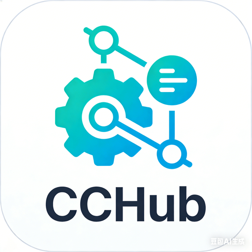

<div align="center">



# CCHub

**Claude Code Full Ecosystem Management Platform**

[](LICENSE)
[](https://tauri.app)
[](https://rust-lang.org)
[](https://react.dev)

[中文](README.zh-CN.md) · English

</div>

---

### Introduction

CCHub is a desktop application for managing the complete Claude Code ecosystem — MCP Servers, Skills, Plugins, and Hooks — all in one place.

The Claude Code ecosystem is growing rapidly, but management is fragmented: manual JSON editing, manual file copying, no unified interface. CCHub is here to fix that.

### Features

- **MCP Server Management** — Auto-scan installed MCP Servers (Claude Code plugins, Claude Desktop, Cursor). Enable/disable, edit config, delete.
- **Skills & Plugins** — Browse installed Skills and Plugins with trigger commands, descriptions, and file paths.
- **Hooks Management** — Visualize all Hooks with event types, matchers, and commands.
- **Update Center** — Check for available updates, one-click upgrade.
- **Dark / Light Theme** — Glassmorphism UI with theme switching.
- **i18n** — Chinese (default) and English.

### Tech Stack

| Layer | Technology |
|---|---|
| Desktop Framework | **Tauri 2.0** — Rust backend + Web frontend, 10x lighter than Electron |
| Frontend | **React 19 + TypeScript + Tailwind CSS 4** |
| Backend | **Rust** — High performance, single binary distribution |
| Database | **SQLite** (rusqlite) — Zero-dependency local storage |
| Build | **Vite 6 + pnpm** |

### Getting Started

#### Prerequisites

- [Node.js](https://nodejs.org) >= 18
- [pnpm](https://pnpm.io) >= 8
- [Rust](https://rustup.rs) >= 1.70
- [Tauri 2.0 Prerequisites](https://v2.tauri.app/start/prerequisites/)

#### Install & Run

```bash
# Clone
git clone https://github.com/Moresl/cchub.git
cd cchub

# Install
pnpm install

# Dev
pnpm tauri dev

# Build
pnpm tauri build
```

Build output in `src-tauri/target/release/`:
- `cchub.exe` — Executable (~6MB)
- `bundle/msi/` — MSI installer
- `bundle/nsis/` — NSIS installer

### Scan Paths

CCHub auto-scans MCP Server configs from:

| Path | Description |
|---|---|
| `~/.claude/plugins/**/.mcp.json` | Claude Code plugin directory (recursive) |
| `%APPDATA%/Claude/claude_desktop_config.json` | Claude Desktop config |
| `~/.cursor/mcp.json` | Cursor editor config |

### Roadmap

- [x] MCP Server management (scan, toggle, edit, delete)
- [x] Skills & Plugins browser
- [x] Hooks visualization
- [x] Update checking
- [x] Dark / Light theme
- [x] i18n (Chinese + English)
- [x] Marketplace (one-click install MCP Servers / Skills)
- [x] CLAUDE.md manager
- [x] MCP Server health monitoring
- [x] Security audit (permission scanning, change detection)
- [x] Auto-update (Tauri Updater)

---

## Contributing

Contributions are welcome! Please feel free to submit a Pull Request.

1. Fork the repository
2. Create your feature branch (`git checkout -b feature/amazing-feature`)
3. Commit your changes (`git commit -m 'Add amazing feature'`)
4. Push to the branch (`git push origin feature/amazing-feature`)
5. Open a Pull Request

## License

This project is licensed under the MIT License — see the [LICENSE](LICENSE) file for details.

## Acknowledgments

- [Tauri](https://tauri.app) — Lightweight desktop app framework
- [Claude Code](https://docs.anthropic.com/en/docs/claude-code) — AI coding assistant
- [MCP](https://modelcontextprotocol.io) — Model Context Protocol
